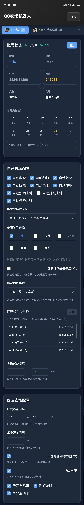

# QQ Farm Bot (Android/Windows/macOS)

本项目基于 [qq-farm-bot](https://github.com/linguo2625469/qq-farm-bot) 核心协议，为 QQ 农场玩家提供了一套跨平台的可视化自动托管解决方案，降低使用成本和门槛。支持 Android (ARM64/ARMv7/通用)、Windows 和 macOS 设备。

## 🌟 主要功能

- **多账号支持**：支持同时管理多个 QQ 农场账号，各账号独立配置、互不干扰。
- **全自动化托管**：自动收获、种菜、施肥、浇水、除草、除虫、偷菜及农场巡查。
- **可视化土地管理**：实时展示各块土地的作物状态、生长阶段、成熟倒计时及异常告警。
- **详尽统计**：实时显示今日金币/经验收益、操作统计（收获、偷菜次数等）及运行总时长。
- **智能策略**：支持随机范围巡查间隔、自动土地解锁与升级、自定义施肥阶段。
- **极佳性能**：针对 Android 端优化内存占用与耗电，日志缓冲区优化，降低系统压力。
- **跨平台体验**：更新检测自动匹配平台，支持 Windows (x64) 和 macOS (M 系列)。

> 💡 **挂机环境提示**
>
> **云电脑方案**：如果你本地没有稳定的挂机环境，可以选择购买云电脑，使用windows系统，操作简单。推荐 [林枫云](https://www.dkdun.cn/buy/lite)，价格低至 **5￥/月**。
>
> 购买后建议按以下步骤使用：
> 1. 在云电脑中安装 **WebView2 Runtime**（[点击下载](https://go.microsoft.com/fwlink/p/?LinkId=2124703)）。
> 2. [**点击下载最新版 Windows exe**](https://github.com/HG-ha/qq-farm-bot-android/releases/latest/download/qq-farm-bot-win-x64.exe)
> 3. 启动程序并完成账号配置后即可挂机运行。
>
> **Android 后台运行**：高版本 Android（12+）由于系统策略限制，可能会对后台应用进行限制。为确保软件正常运行，建议在系统设置中：
> - 关闭电池优化（Battery Optimization）
> - 允许后台活动
> - 禁用省电模式（Power Saving Mode）

## 📥 下载安装

请前往 [Releases 页面](https://github.com/HG-ha/qq-farm-bot-android/releases) 下载对应平台的最新版本。

### 📱 Android 版本

| 文件名 | 说明 | 大小 |
| :--- | :--- | :--- |
| `qq-farm-bot-arm64-v8a.apk` | **推荐** 用于 64 位 Android 设备（最新旗舰机、平板等） | 9.41 MB |
| `qq-farm-bot-armeabi-v7a.apk` | 用于 32 位 Android 设备（较旧手机） | 6.94 MB |
| `qq-farm-bot.apk` | 通用版本（包含多架构支持，不知道选哪个用这个） | 13.9 MB |

> **如何选择？**
> - 新购买的手机（2018 年后）：选择 `arm64-v8a`
> - 旧手机或不确定：选择 `qq-farm-bot.apk` 通用版

### 💻 Windows 版本

| 文件名 | 说明 | 大小 | 使用方式 |
| :--- | :--- | :--- | :--- |
| `qq-farm-bot-win-x64.exe` | Windows x64（64 位） | 5.87 MB | 双击直接运行，需已安装 WebView2 |

**Windows 使用步骤：**
1. 确保已安装 **WebView2 Runtime**（[点击下载](https://go.microsoft.com/fwlink/p/?LinkId=2124703)）
2. 下载 `qq-farm-bot-win-x64.exe`
3. 双击运行，根据提示登录 QQ 账号并配置即可

### 🍎 macOS 版本

| 文件名 | 说明 | 大小 |
| :--- | :--- | :--- |
| `qq-farm-bot-mac-arm64.M4.dmg` | macOS（Apple Silicon M4/M3/M2/M1） | 5.53 MB |

**macOS 使用步骤：**
1. 下载 `.dmg` 文件
2. 双击打开，将应用拖入 Applications 文件夹
3. 启动应用即可使用

## 💬 交流社区

- **官方 Q 群**：**376957298**

## 📸 软件截图

   
  <b>状态通知</b>  
   
  <b>主界面</b>

## 📜 更新记录

### v1.4.0
- **多账号支持**：顶部账号标签栏，显示头像、昵称、运行状态，支持一键切换不中断。
- **今日操作统计**：新增每日收益（金币/经验）及操作次数（收获、偷菜等）面板。
- **头像显示**：账号栏展示 QQ 头像。
- **自动逻辑增强**：支持自动解锁、升级土地；增加随机巡查间隔支持。
- **自定义施肥**：支持自定义施肥阶段配置，加速成长。
- **性能优化**：Android 改为单一全局通知循环；日志缓冲区减至 50 条；图标全面升级为 SVG。

### v1.3.0
- **平台扩充**：增加 ARM64/ARMv7 Android 包及 Windows-x64、macOS M4 支持。
- **修复**：解决登录 Code 记录与请求问题。
- **优化**：改进通知栏日志显示。

### v1.2.0
- **自动施肥**：新增自动施肥功能及优先级配置（普通/有机化肥优先）。
- **交互升级**：新增底部导航栏，支持首页与土地页面切换。
- **状态感知**：土地页面实时展示生长倒计时；账号卡片显示运行时长。
- **快捷操作**：引入悬浮圆形按钮（启动/停止/保存）。
- **UI 优化**：自定义下拉搜索菜单；优化种子选择逻辑。

### v1.1.0
- **检测更新**：集成应用内版本检测功能。
- **省电加速**：优化内存管理，大幅降低后台运行耗电量。
- **交互修复**：侧滑返回改为回到桌面而非直接退出。

### v1.0.0
- 初始版本发布，支持核心托管功能。

## ⚠️ 免责声明

1. 本软件为**免费开源软件**，仅供学习交流使用。
2. 严禁将本软件用于任何形式的商业用途或非法用途。
3. 请通过官方渠道下载，对于使用非官方版本导致的任何账号安全问题，作者概不负责。
